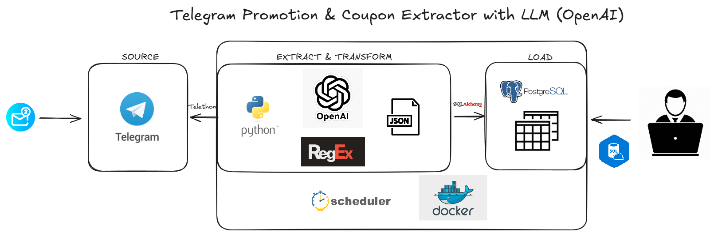

# Telegram Promotion & Coupon Extractor with LLM (OpenAI)

## Overview

This project implements an end-to-end automated pipeline that monitors specific Telegram groups and channels for messages regarding promotions and coupons. Relevant messages are processed by a Large Language Model (LLM) via the OpenAI API to extract structured information (such as product name, prices, coupon details, etc.). This extracted data is then stored in a PostgreSQL database for later analysis.

The pipeline is scheduled to run periodically using the `schedule` Python library and is designed to be executed via Docker Compose.

## How it Works

1.  **Telegram Monitoring:** The system connects to Telegram using the Telethon library.
2.  **Message Fetching:** New messages are fetched from a predefined list of `CHAT_IDS` at regular intervals.
3.  **Filtering & LLM Processing:** Messages are initially filtered to identify potentially promotional content. Relevant messages are then sent to the OpenAI API (e.g., GPT model) for structured data extraction (product name, prices, coupon details, etc.) into JSON format.
4.  **Database Storage:** The raw message data and the LLM-extracted information are stored in a PostgreSQL database for future analysis and use.
5.  **Scheduling:** A Python script using the `schedule` library ensures the fetching and processing pipeline runs every 12 hours.
6.  **Containerization:** The Python application and the PostgreSQL database run in Docker containers, managed by Docker Compose for ease of setup and deployment.

## Architecture



1.  **SOURCE**
    * **Telegram Groups/Channels:** The source of messages containing promotions and coupons.
    * **Telethon:** Python library used to interact with the Telegram API and fetch messages.

2.  **EXTRACT & TRANSFORM**
    * **Python Script (`src/main.py`):** Orchestrates the fetching, filtering, and LLM calling process.
    * **`src/processing/message_processor.py`:** Contains the logic for:
        * Filtering relevant messages.
        * Constructing prompts for the LLM.
        * Calling the OpenAI API.
        * Parsing the JSON response from the LLM.
    * **OpenAI API GPT-4o mini:** Large Language Model used to understand message text and extract the requested structured data.

3.  **LOAD**
    * **`src/handlers/database_handler.py`:** Responsible for all database interactions.
    * **psycopg2 via `RDSPostgreSQLManager`:** Python adapter for PostgreSQL, used to communicate with the database.
    * **PostgreSQL:** Relational database where messages and extracted data are stored.

4.  **SCHEDULING & EXECUTION**
    * **`schedule` (Python library):** Used within the main script to schedule pipeline execution every 12 hours.
    * **Docker:** The Python application and PostgreSQL database run in Docker containers, managed by Docker Compose.

## Prerequisites

- [`pyenv`](https://github.com/pyenv/pyenv) - Python version management
- [`poetry`](https://python-poetry.org/) - Dependency management
- [`docker`](https://www.docker.com/) - Containerization
- [`Git`](https://git-scm.com/downloads) and [`Github`](https://github.com/) (for cloning the repository)
- [`OpenAI Platform`](https://platform.openai.com/) account with a valid API key and configured billing/credits.
- [`Telegram API`](https://my.telegram.org/apps) credentials (API ID and API Hash).

## Project Structure

```
API-PIPELINE-WITH-AGENT/
├── .env                      # Environment configuration
├── .env.example              # Example .env file
├── docker/                   # Docker configuration files
│   ├── docker-compose.yml    # Defines Docker services
│   └── telegram_extract.Dockerfile # Defines the Python application image
├── pyproject.toml            # Project definitions and dependencies for Poetry
├── poetry.lock               # Poetry lock file
├── src/                      # Application source code
│   ├── core/
│   │   └── config.py         # Loads configuration, initializes logger
│   ├── handlers/
│   │   ├── database_handler.py # Handles PostgreSQL interactions
│   │   └── telegram_handler.py # Handles Telegram API (Telethon)
│   ├── processing/
│   │   └── message_processor.py # Handles message processing & LLM calls
│   ├── tools/
│   │   └── rds_postgres_manager.py # (Your PostgreSQL connection manager)
│   ├── utils/
│   │    └── state_manager.py    # Manages state (last processed message ID)
│   └── main.py                # Main entry point to run pipeline, schedules the pipeline    
├── telegram_messages_session.session          # file for storing Telethon session
├── last_processed_ids.json   # File for storing the last processed message ID per chat
└── README.md                 # documentation for the project
```

## Setup

1.  **Clone the Repository:**
    ```bash
    git clone <YOUR_GIT_REPOSITORY_URL>
    cd <YOUR_REPOSITORY_NAME>
    ```

2.  **Create `.env` File:**
    Copy the `.env.example` file (if you create one) or create a new file named `.env` in the project root and fill it with your credentials.
    **Location:** `API-PIPELINE-WITH-AGENT/.env`

    `.env` content should look like this:
    ```env
    # Telegram API Credentials (my.telegram.org)
    API_ID=YOUR_API_ID
    API_HASH=YOUR_API_HASH
    PHONE_NUMBER=+12345678900 # Your phone number with country code

    # PostgreSQL Database Credentials
    DB_USER=postgres
    DB_PASSWORD=your_strong_postgres_password # Use a strong password
    DB_NAME=telegram_data
    DB_PORT=5432 # Internal Postgres container port
    DB_PORT_HOST=5432 # Port exposed on YOUR computer (host) - can be 5433, etc.

    # OpenAI API
    OPENAI_API_KEY=sk-YOUR_OPENAI_API_KEY
    OPENAI_MODEL_NAME=gpt-4o-mini # or gpt-3.5-turbo, gpt-4o
    OPENAI_REQUEST_TIMEOUT=120 # In seconds

    # (Optional) Message Fetch Limit
    # MESSAGES_FETCH_LIMIT=50
    # (Optional) Chat IDs to monitor (if not hardcoded in config.py)
    # CHAT_IDS="-1001234567890,-1009876543210" # Comma-separated
    ```

3.  **Create Necessary Directories and Files (if not existing):**
    In the project root, create the directory for Telethon sessions and the initial state file:
    ```bash
    mkdir -p telegram_sessions
    touch last_processed_ids.json
    echo "{}" > last_processed_ids.json # Ensures it's a valid, empty JSON
    ```
    * **Important:** Ensure `SESSION_NAME` in `src/core/config.py` is set to save session files into this directory (e.g., `"telegram_sessions/my_session_name"`). Also, ensure `LAST_IDS_FILE` in `config.py` is `"last_processed_ids.json"`.

4.  **(Optional) Python Virtual Environment for Local Development:**
    This project uses Poetry for dependency management (primarily for the Docker build). If you wish to develop or run scripts locally outside Docker:
    ```bash
    # poetry install # To install dependencies from pyproject.toml
    # poetry shell   # To activate the virtual environment
    ```

## Running the Application (with Docker Compose)

All `docker-compose` commands should be run from the **project root** (`API-PIPELINE-WITH-AGENT/`).

1.  **Build and Start Docker Services:**
    ```bash
    docker-compose -f docker/docker-compose.yml --env-file .env up -d --build
    ```
    * `-f docker/docker-compose.yml`: Specifies the path to your compose file.
    * `--env-file .env`: Loads environment variables from the `.env` file in the project root.
    * `up -d --build`: Starts services in detached mode (`-d`) and rebuilds the application image (`--build`) if the `Dockerfile` or its context has changed.

2.  **Initial Telegram Login (First Time Only, if needed):**
    If the Telethon session file (e.g., `telegram_sessions/your_session_name.session`) doesn't exist or is invalid, the Python script will require authentication.
    To provide the login code sent by Telegram:
    ```bash
    docker-compose -f docker/docker-compose.yml --env-file .env run --rm app
    ```
    This command runs the `app` service interactively. Follow the prompts in your terminal. Once authenticated, the session file will be saved in the `telegram_sessions/` volume on your host. You can then stop this command (`Ctrl+C`) and start services normally with `up -d`.

    Alternatively, generate the session file by running `src/utils/main.py` once on your local machine (ensuring `config.py` points `SESSION_NAME` to the `telegram_sessions/` folder) and then copy the generated `.session` file into the `telegram_sessions/` folder in your project root.

3.  **Checking Logs:**
    To view logs from your Python application (service `app`):
    ```bash
    docker-compose -f docker/docker-compose.yml --env-file .env logs -f app
    ```
    To view logs from PostgreSQL (service `postgres_db`):
    ```bash
    docker-compose -f docker/docker-compose.yml --env-file .env logs -f postgres_db
    ```
    You should see logs from `loguru` indicating the scheduler has started and the pipeline task is being executed/scheduled every 12 hours.

## How it Works (Detailed Flow)

1.  The `src/utils/main.py` script is the main entry point.
2.  It uses the `schedule` library to schedule the `run_telegram_pipeline` function every 12 hours.
3.  When `run_telegram_pipeline` executes:
    * It connects to Telegram using credentials from `config.py` (`telegram_handler.py`).
    * It fetches new messages from the configured `CHAT_IDS` since the last processed ID (`state_manager.py`).
    * For each message deemed potentially promotional (`message_processor.py` -> `is_potentially_promotional`):
        * A prompt is constructed with the message text.
        * A call is made to the OpenAI API (`message_processor.py` -> `extract_promotion_info_with_openai`) to get structured JSON data.
    * The original message data and the OpenAI JSON response are stored in PostgreSQL (`database_handler.py`). The extracted JSON is also parsed and inserted into a structured promotions table.
    * The ID of the last processed message for each chat is saved for the next run.
4.  The script remains running, with the `schedule` loop periodically checking for due tasks.

## Configuration Details

* **`.env` (Project Root):** Contains all sensitive credentials and runtime configurations.
* **`src/core/config.py`**: Loads variables from `.env` and defines other application constants. You can modify `CHAT_IDS`, `MESSAGES_FETCH_LIMIT`, `SESSION_NAME`, `LAST_IDS_FILE` here.
* **`OPENAI_MODEL_NAME`**: Defined in `.env` or `config.py`. Allows choosing different OpenAI models (e.g., `gpt-3.5-turbo`, `gpt-4o-mini`, `gpt-4o`) based on cost and quality requirements.

## Docker Configuration

* **`docker/telegram_extract.Dockerfile`**: Contains instructions to build the Docker image for your Python application using Poetry for dependency management.
* **`docker/docker-compose.yml`**: Defines and orchestrates your application service (`app`) and the PostgreSQL database service (`postgres_db`), including networks and volumes.

## Contributing

(Add this section if your project is open to contributions, with guidelines on how to contribute, report bugs, etc.)

## License

(Add this section if you wish to specify a license for your project, e.g., MIT, Apache 2.0)